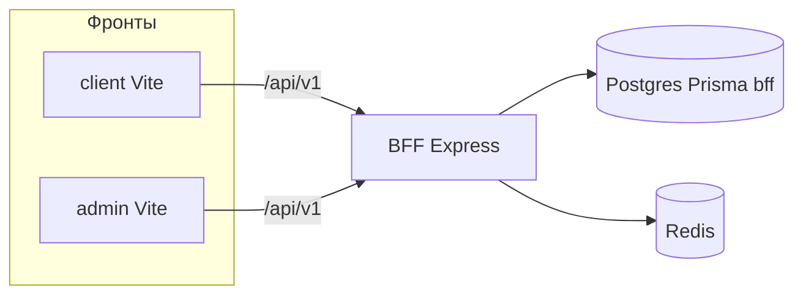

# Basalt Arena

Монорепозиторий: **арена** (`client`), **админка** (`admin`), **BFF** (`bff`) — Express + TypeScript, Postgres (Prisma, схема `bff`), Redis. Публичный UI и админка ходят в **`/api/v1/*`** на BFF.

---

## Содержание

| Раздел                                                                     | О чём                            |
| -------------------------------------------------------------------------- | -------------------------------- |
| [За 5 минут до первого запуска](#-за-5-минут-до-первого-запуска)           | Минимальный чеклист без «танцев» |
| [Требования](#-требования)                                                 | Node, Docker, порты              |
| [Архитектура](#-архитектура)                                               | Как связаны части                |
| [Скрипты](#-скрипты-корень-и-bff)                                          | `npm run …`                      |
| [Переменные окружения](#-переменные-окружения)                             | `.env.example`                   |
| [Тесты и качество](#-тесты)                                                | unit / integration               |
| [Деплой на сервер](#-деплой-на-сервер)                                     | скрипт bootstrap Ubuntu + nginx  |
| [Синхронизация БД с локали на сервер](#-синхронизация-бд-локально--сервер) | дамп схемы `bff`                 |
| [Частые проблемы](#-частые-проблемы)                                       | 401, 503, порты, Prisma          |

---

## За 5 минут до первого запуска

Скопируйте блок **по порядку** в терминал из корня репозитория (после `git clone`).

```bash
# 1) Зависимости + .env из примера (существующий .env не трогает)
npm run setup

# 2) Postgres (5433) + Redis (6379). Любой из вариантов:
docker compose up -d
# или, если нет плагина compose:
# docker-compose up -d

# 3) Миграции БД + нормализация ролей (идемпотентно) + сид
npm run db:migrate
npm run db:seed

# 4) Клиент + BFF + админка
npm run dev:all
```

Дальше откройте в браузере:

| Что        | URL                                                                        |
| ---------- | -------------------------------------------------------------------------- |
| Арена      | [http://localhost:5173](http://localhost:5173)                             |
| Админка    | [http://localhost:5174](http://localhost:5174)                             |
| Health BFF | [http://localhost:3001/api/v1/health](http://localhost:3001/api/v1/health) |

> **Логин админа после сида:** `admin@admin.com` — пароль в `.env`: `SEED_ADMIN_PASSWORD` (в примере задан `admin1234`; см. `bff/prisma/seed.ts`).

Если что-то из шагов падает — см. [Частые проблемы](#-частые-проблемы).

---

## Требования

|             | Версия / примечание                                                     |
| ----------- | ----------------------------------------------------------------------- |
| **Node.js** | **≥ 20** (в `package.json` → `engines`)                                 |
| **npm**     | **≥ 10**                                                                |
| **Docker**  | Для Postgres + Redis локально; для integration-тестов                   |
| **Порты**   | `5433` (Postgres), `6379` (Redis), `3001` (BFF), `5173` / `5174` (Vite) |

---

## Архитектура



- **BFF** — единственная публичная поверхность API: `routes → services → repositories → prisma`.
- **Redis** — rate-limit, данные вокруг refresh-сессий.
- **`server`** — legacy mock, только `npm run dev:mock`; в основной схеме не используется.

---

## Скрипты (корень и `bff`)

### Корень

| Команда                       | Назначение                                                                                                         |
| ----------------------------- | ------------------------------------------------------------------------------------------------------------------ |
| `npm run setup`               | Нет `.env` → копия из `.env.example` в корень и `bff/.env`, затем `npm install` и Prisma Client                    |
| `npm run db:migrate`          | `prisma migrate deploy` + нормализация enum `UserRole` в Docker Postgres (см. `deploy/run-user-role-normalize.sh`) |
| `npm run db:normalize-roles`  | Только нормализация ролей в БД (если поднят `postgres` в compose)                                                  |
| `npm run db:seed`             | Сид данных (после миграций)                                                                                        |
| `npm run dev`                 | Клиент + BFF                                                                                                       |
| `npm run dev:all`             | Клиент + BFF + админка                                                                                             |
| `npm run dev:mock`            | Клиент + legacy `server`                                                                                           |
| `npm run build` / `build:all` | Сборка `bff` + `client` + `admin`                                                                                  |
| `npm run test`                | Unit-тесты BFF                                                                                                     |
| `npm run verify`              | Формат + lint + typecheck + unit                                                                                   |

### `bff/`

| Команда                    | Назначение                               |
| -------------------------- | ---------------------------------------- |
| `npm run dev`              | `tsx` watch                              |
| `npm run build`            | `tsc` → `dist/`                          |
| `npm run start`            | `node dist/index.js`                     |
| `npm run db:migrate:dev`   | Новые миграции в разработке (интерактив) |
| `npm run test:integration` | Нужен Docker (testcontainers)            |

---

## Переменные окружения

Полный пример и комментарии — **[`.env.example`](.env.example)** в корне.

Критичные при выкате на сервер:

| Переменная                                 | Назначение                                      |
| ------------------------------------------ | ----------------------------------------------- |
| `DATABASE_URL`                             | Postgres (в compose по умолчанию порт **5433**) |
| `REDIS_URL`                                | Redis                                           |
| `JWT_ACCESS_SECRET` / `JWT_REFRESH_SECRET` | Разные строки, каждая **≥ 32** символов         |
| `CORS_ORIGINS`                             | CSV origins для браузера                        |

---

## Тесты

- **Unit:** `npm run test` (или `npm run test:unit -w bff`) — без Docker.
- **Integration:** `INTEGRATION=1 npm run test:integration -w bff` — нужен Docker.

Документы по контракту и инвариантам: `bff/docs/adr-001-api-contract.md`, `adr-002-auth-and-persistence.md`, `adr-003-sprint-access-and-admin.md`.

---

## Деплой на сервер

Один сценарий на **чистом Ubuntu** — **[`deploy/ubuntu-bootstrap-once.sh`](deploy/ubuntu-bootstrap-once.sh)** (Docker, Node 22, clone, compose, миграции, сид, сборка, systemd `basalt-bff`, nginx на `:80` и `:8080`).

Пример:

```bash
export PUBLIC_ORIGIN=http://ВАШ_IP_или_домен
bash deploy/ubuntu-bootstrap-once.sh
```

После сида пароль админа смотрите в `~/bazalt-arena/.env` → `SEED_ADMIN_PASSWORD`.

> Nginx читает статику из домашнего каталога: скрипт выставляет `chmod o+x $HOME`, чтобы `www-data` мог зайти в `client/dist` и `admin/dist`.

---

## Синхронизация БД (локально → сервер)

Если нужно перенести **всю схему `bff`** с локального Postgres на сервер (пользователи, хеши паролей, спринты и т.д.):

```bash
export SSH_KEY=/path/to/server-key.pem
export REMOTE_HOST=ubuntu@ВАШ_IP
bash deploy/sync-bff-db-from-local-to-server.sh
```

Скрипт останавливает BFF, заливает дамп, при необходимости приводит `UserRole` к `ADMIN`/`USER`, снова поднимает BFF.

---

## Частые проблемы

| Симптом                          | Что проверить                                                                                                |
| -------------------------------- | ------------------------------------------------------------------------------------------------------------ |
| **Не стартует BFF**              | Заполнены ли обязательные поля в `.env` / `bff/.env`; запущены ли `docker compose up -d` (Postgres + Redis). |
| **503 / DATABASE_UNAVAILABLE**   | `DATABASE_URL`, порт **5433**, контейнер `postgres` healthy.                                                 |
| **503 / «MEMBER» и UserRole**    | Запустите `npm run db:normalize-roles` (или снова `npm run db:migrate`) при поднятом Postgres в compose.     |
| **401 в админке**                | Токен; залогиньтесь заново после смены `JWT_*` на сервере.                                                   |
| **`docker compose` не найден**   | Установите [Docker Compose V2](https://docs.docker.com/compose/) или используйте `docker-compose` из README. |
| **`npm ci` / EACCES на сервере** | Не ставьте зависимости под `root` в каталоге приложения; `sudo chown -R ubuntu:ubuntu ~/bazalt-arena`.       |

---

## DX (формат, линт, pre-commit)

- `npm run format` / `format:check` — Prettier по монорепо.
- `npm run lint` — ESLint для `bff`, `client`, `admin`.
- Husky: перед коммитом `lint-staged`, typecheck BFF, unit-тесты BFF.

---

## API

Спецификация: **[`bff/openapi/openapi.yaml`](bff/openapi/openapi.yaml)**.

Ошибки в едином виде: `{ code, message, details?, requestId }`.

---

## Обновление после смены истории `main`

Если локальный клон сделан до пересборки истории на GitHub:

```bash
git fetch origin
git reset --hard origin/main
```

Или заново `git clone` — так проще, если есть локальные ветки от старого `main`.
